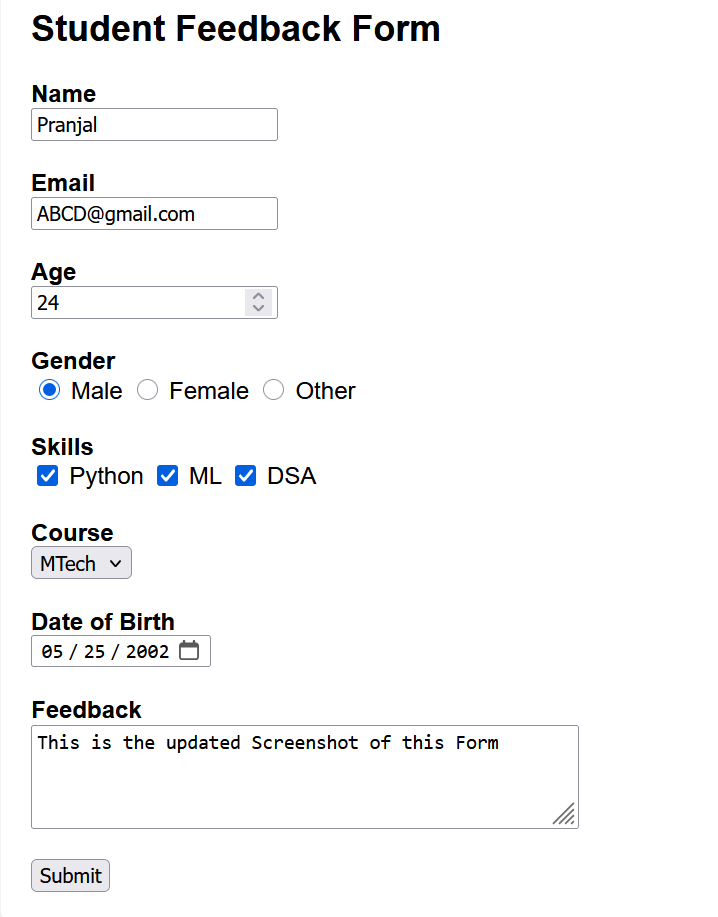
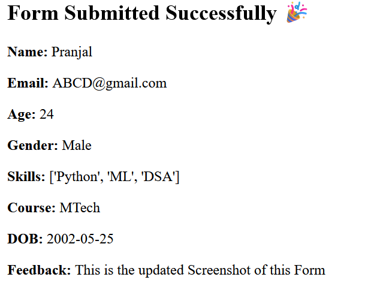

# 📝 Form using Elements (Flask – Python)

A **Python-based web form application** built using **Flask**, demonstrating the use of all common **HTML form elements** such as text inputs, radio buttons, checkboxes, dropdowns, date pickers, and text areas.
This project focuses on **form handling and backend processing** using Flask.

---

## 🚀 Features

* ✏️ Text input (Name)
* 📧 Email input
* 🔢 Number input (Age)
* 🔘 Radio buttons (Gender)
* ☑️ Checkboxes (Skills)
* 🔽 Dropdown / Select menu (Course)
* 📅 Date picker (Date of Birth)
* 📝 Textarea (Feedback)
* ✅ Form submission with response display
* 🌐 Flask backend with Jinja2 templates

---

## 🛠️ Tech Stack

* **Backend:** Python, Flask
* **Frontend:** HTML, CSS
* **Template Engine:** Jinja2
* **Server:** Flask Development Server

---

## ⚙️ Installation & Setup

### 1️⃣ Clone the Repository

```bash
git clone https://github.com/pranjal25r/Form-using-Elements.git
cd Form-using-Elements
```

### 2️⃣ Run the Application

```bash
python app.py
```

### 3️⃣ Open in Browser

```
http://127.0.0.1:5000/
```

---

## 📸 Screenshots


<p align="center">
  
</p>

<p align="center">
  
</p>

---

## 🧠 How It Works

1. User fills out the form using different input elements.
2. Data is sent to the Flask backend via a **POST request**.
3. Flask collects data using `request.form`.
4. Submitted data is displayed on a confirmation page.

---

## 🎯 Learning Outcomes

* Understanding HTML form elements
* Handling GET and POST requests in Flask
* Using Jinja2 for dynamic templates
* Backend form validation basics
* Structuring a Flask project

---

## 📌 Use Cases

* Flask practice project
* College mini project
* Learning web forms
* Backend development basics
* Resume / GitHub showcase project

---

## 🔮 Future Enhancements

* 💾 Store form responses in a database (SQLite / MySQL)
* 📊 Admin panel to view submissions
* 🔐 User authentication
* 📤 Export responses to CSV
* 🎨 Improved UI using Bootstrap or Tailwind CSS
* ☁️ Deployment on cloud platforms
